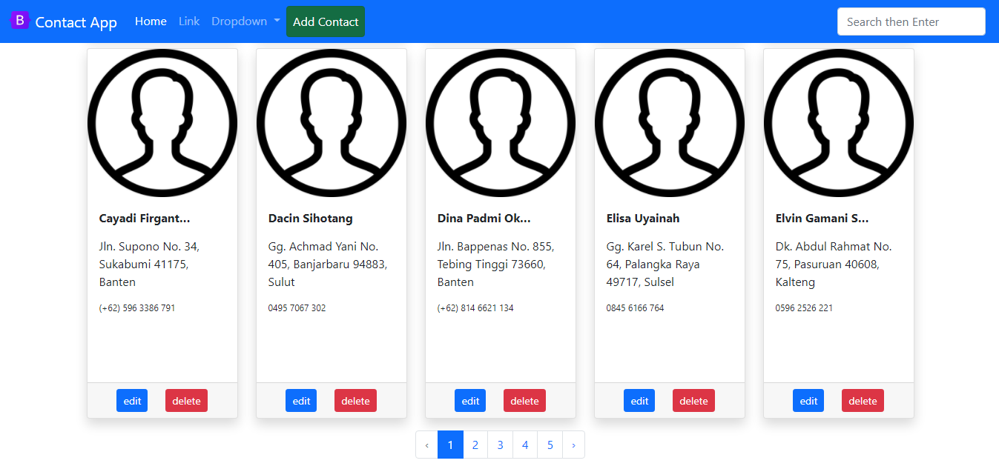

## Running
- clone this repo
- setting your database in .env file
- run `php artisan migrate:refresh --seed`
- run `php artisan serve`
- open browser with url [http://127.0.0.1:8000](http://127.0.0.1:8000/)

###### Follow Me
- [x] [https://www.ihsanbagus.com/](https://www.ihsanbagus.com/)
- [x] [Facebook/](https://www.fb.me/orangilir)
